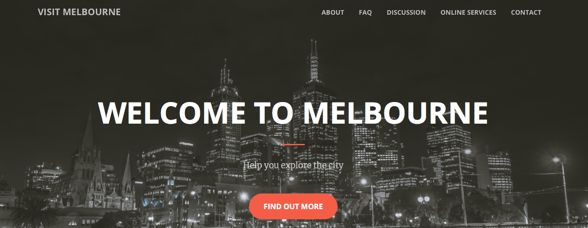

# website

To hone my skills of web development, I would like to development a website for travelling information service which features a discussion board, AI chatbot and data visualization. As a result of that it is my first year in Melbourne, I think that there are a lot of things to explore in the city.

The major techniques used to implement the website are Python and Django. This combination is the most popular way to implement a website. Plus, I also used some useful components via Bootstrap, such as CSS-based components. The major feature of Django is that it implements the MVC, or I should say MTV, so that the website is easily to scale up and maintain. On the other hand, I would like to add other features to the website: ChatBot and Data visualization. I think the variety of libraries of Python and techniques compatible to it would be very helpful. All works were running in the python virtual environment to make sure that the work is independent from others. That was why I chose Python and Django to implement the website.

The website met all requirements listed in the description. It includes standard routine of about, FAQ, contact etc as shown in Figure 1, 2 and 3:

 

Figure 1. The standard routine: About (presented by multimedias)
 
 

Figure 2. The standard routine: FAQ (with ipsum text)

 
 
Figure 3. The standard routine: Contact

But not limited to them; according to the essence of the website: promote traveling, the website also shows some famous tourist spots via jQuery as shown in Figure 4:
 
 
 
 
Figure 4. More features beyond the requirement

As for the multi-step webform, it was implemented in the form of anonymous discussion board. In the discussion board, guests can post their subject which includes the topic of the subject, their name, and the content, and then others can reply to the subject to share information or discuss. The link to the Discussion Board can be found on the navigation bar on the homepage as well, and redirect to the homepage of Discussion Board as Figure 5:

 
 
Figure 5. The homepage of The Discussion board

Replying to a topic and reading all replies to a topic are shown in Figure 6 and 7:
 
 

Figure 6. Reply to one topic

 

Figure 7. Read all replies to a topic

On the other hand, Chatbot is a trend for online information service, so I also deployed one for interact naturally with users for customer support. It can be activated by the link “ONLINE SERVICES” at the homepage. Clicking the link will redirect to a new page and start a chat with Chatbot. The Chatbot was implemented by ChatterBot which is one of Python Libraries and trained to reply most basic conversations and questions relating to traveling, such as “What is the most famous spot in Melbourne?” or “Which restaurant is the best?” etc. The response to these questions is shown in Figure 8.

 
 
Figure 8. Chatting with Chatbot about traveling

The last feature was data visualization implemented by D3.js. I utilized D3.js to visualize the number of tourists from all over the world to Melbourne into circles with different size based on the number of tourists from that country. That is, that more tourists coming from that country will lead to a larger circle so that users can understand what is the result that data presents at once. On the other hand, for the more concise and obvious result, only the country with the number of tourists greater than 60,000 will show its name on the circle. The visualized data is like the Figure 9:

 

Figure 9. Visualized number of tourists from different countries 

To sum up, this project used the following techniques: HTML, CSS, Javascript, JQuery, Python, Django, Bootstrap, ChatterBot and D3.js. It might not a perfect outcome, but I really have learnt a lot from this project and thank to the opportunity. After I completed the project, I know I still has a lot to learn and am excited about it!

